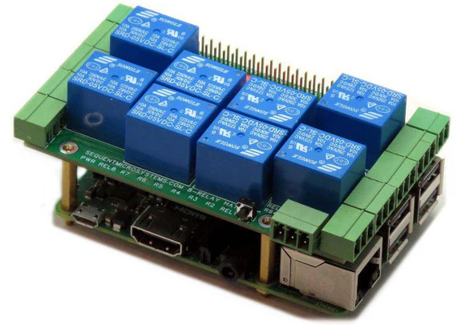

# SM_8rel-Library

Arduino library for Sequent Microsystems [Eight Relays 8-Layer Stackable HAT for Raspberry Pi](https://sequentmicrosystems.com/products/eight-relays-stackable-card-for-raspberry-pi)

## Install
### Library manager
Go to **Tools**>>**Manage Libraries..** menu and search for *SM_8RELAY* and click install 
### Manual install
This method lets the Arduino IDE unpack and position the library files for you automatically. 
1. Download the library as a ZIP file (e.g., from GitHub). 
2. Do not unzip it.Open the Arduino IDE.In the top menu, navigate to Sketch > Include Library > Add .ZIP Library.
3. Browse to your computer's Downloads folder, select the .zip file, and click Open.
4. The IDE will install the library. You can now inclusion-check it under Sketch > Include Library. 

Open an arduino sketch, go to File > Examples > SM_8RELAY > and chose your example to run.

## Usage
There are three ways to control the Eight Relays Card from the Arduino environment.

### Method 1: Using any Arduino controller
You can use this method with any Arduino card with an I2C port by connecting I2C-SDA, I2C-SCL, +5V and GND, as shown in the following table.
      
| SIGNAL | PIN# |CONN| PIN# | SIGNAL|
|---|---|---|---|---|
| | --1 | O - O | 2-- |  +5V | 
| I2C-SDA | --3| O - O | 4-- |  +5V |
| I2C-SCL |-- 5|O - O| 6--|  GND |
|  |-- 7|O - O| 8--||
| GND |-- 9|O - O|10--||
| |--11|O - O|12--||
| |--13|O - O|14--| GND|
| |--15|O - O|16--||
||--17|O - O|18--||
||--19|O - O|20--|  GND|
||--21|O - O|22--||
||--23|O - O|24--||
|GND |--25|O - O|26--||
||--27|O - O|28--||
||--29|O - O|30--|  GND|
||--31|O - O|32--||
||--33|O - O|34--|  GND|
||--35|O - O|36--||
||--37|O - O|38--||
|GND |--39|O - O|40--||
 
### Method 2: Using the SM Arduino Raspberry Pi Replacement Kit
Sequent Microsystems [Arduino Uno, Nano, Teensy, Feather or ESP32 Raspberry Pi Replacement Kit](https://sequentmicrosystems.com/products/raspberry-pi-replacement-card) is an inexpensive adapter which can be used to control any of our HATs using Uno, Nano, Teensy, Feather or ESP32. Plug the Eight Relays HAT into the 40 pin connector of the adapter and write your Arduino software.

### Method 3: Using the [SM ESP32-Pi Raspberry Pi Alternative Card](https://sequentmicrosystems.com/collections/all-io-cards/products/esp32-pi-low-cost-replacement-for-raspberry-pi)
ESP32-Pi is a Raspberry Pi alternate solution which can control directly the Eight Relays HAT.
In your sketchbook set the board type to DOIT ESP32 DEVKIT V1: Tool >> Board >> ESP32 Arduino >> DOIT ESP32 DEVKIT V1

## Function prototypes
 
	/*!
 	 * @brief Class constructor
	 * @param stack - The stack level of the card, choosed with the jumpers
	 */
	SM_8REL(uint8_t stack = 0);
 
	/*!
	 * @brief Check card presence
	 * @return Returns true is successful
	 */
	bool begin();

	/*!
	 * @brief Return card existance status
	 * @return Returns true if card is present
	 */
	bool isAlive();

	/*!
	 * @brief Set one relay state
	 * @param relay -  Relay number 1..4 as are printed on the card
	 * @param val The new state of the relay, true: energised
	 * @return Returns true if successful
	 */
	bool writeRelay(uint8_t relay, bool val);

	/*!
	 * @brief Write all relays state as a 4 bits bitmap
	 * @param val The bitmap of the relays states
	 * @return Returns true if successful
	 */
	bool writeRelay(uint8_t val);
	
	 /*!
	 * @brief Read button current state.
	 * @return true - pushed; false - released.
	 */
	bool readButton();
	
	
